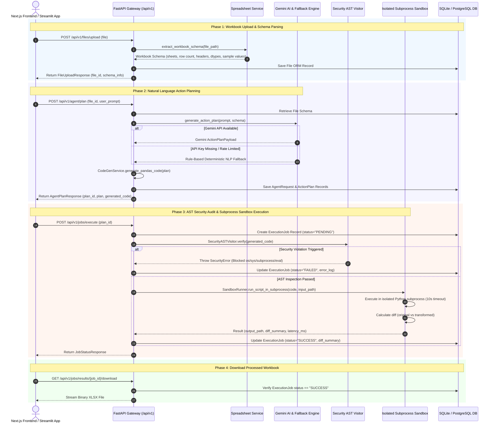

# SheetPilot AI — Backend & Worker Architecture Roadmap

> **Module Goal**: Production-grade Python FastAPI Web Gateway, SQLite/PostgreSQL database persistence, Background Job Queue, static AST Python security sandbox runner, Google Gemini AI action planner with rule-based fallback, and multi-sheet Pandas engine.

---

## 🛠️ Tech Stack & Initialization Commands

```bash
# 1. Navigate to backend directory
cd backend

# 2. Activate Python virtual environment
# Windows PowerShell:
.\venv\Scripts\Activate.ps1
# Linux/macOS:
source venv/bin/activate

# 3. Install backend dependencies
pip install fastapi uvicorn pandas openpyxl google-generativeai pydantic sqlalchemy httpx pytest

# 4. Launch FastAPI development server (runs on http://localhost:8000)
uvicorn app.main:app --reload --host 0.0.0.0 --port 8000
```

---

## 📂 Project Directory Structure

```text
backend/
├── storage/                    # Persistent disk storage for raw uploads & transformed workbooks
└── app/
    ├── main.py                 # FastAPI Entrypoint, CORS Middleware & Health Check Endpoint
    ├── core/
    │   ├── config.py           # Pydantic BaseSettings & Environment Variables
    │   └── database.py         # SQLAlchemy Engine, Session Local & Table Metadata
    ├── models/                 # SQLAlchemy ORM Models
    │   ├── file.py             # File Metadata Record Schema
    │   ├── agent_request.py    # Agent Plan Record Schema
    │   └── execution_job.py    # Subprocess Job Execution Record Schema
    ├── schemas/                # Pydantic Data Transfer Objects (DTOs)
    │   ├── file.py             # FileUploadResponse & SchemaInfo DTOs
    │   ├── plan.py             # ActionPlanPayload & PlanRequest DTOs
    │   └── job.py              # ExecutionTrigger & JobStatus DTOs
    ├── services/               # Core Business Logic Layer
    │   ├── spreadsheet_service.py # Header Detection, Schema Extraction & Multi-Sheet Pandas Loader
    │   ├── ai_service.py       # Google Gemini API & Rule-Based Fallback Prompt Engine
    │   ├── code_gen_service.py # Dynamic Pandas Script Generator with Header Auto-Detection
    │   ├── security_service.py # Schema & Column Constraint Validator
    │   └── storage_service.py  # File Storage & Key Management
    ├── sandbox/                # Isolated Subprocess Sandbox Environment
    │   ├── ast_checker.py      # SecurityASTVisitor for Static Code Inspection
    │   └── runner.py           # Subprocess Execution Engine, Timeouts & Diff Calculator
    ├── workers/                # Task Queue & Async Workers
    │   ├── queue.py            # RQ Queue Connection Helper
    │   └── tasks.py            # Async Execution Job Task Runner
    └── api/
        └── v1/
            └── endpoints/
                ├── files.py    # File Upload & Schema API Endpoints
                ├── agent.py    # AI Plan Generation API Endpoints
                └── jobs.py     # Sandbox Job Execution & Result Download Endpoints
```

---

## 🔀 System Request Workflow & Sequence Diagram



---

## 📅 Step-by-Step Backend Implementation Roadmap

### Phase 1: FastAPI Gateway & Health Subsystem (`app/main.py`)
- [x] Configure FastAPI web server with CORS origins for Next.js (`http://localhost:3000`) and Streamlit (`http://localhost:8501`).
- [x] Implement `GET /health` endpoint returning system status, timestamp, and database connectivity metrics.

### Phase 2: Schema Extraction & Spreadsheet Parser (`app/services/spreadsheet_service.py`)
- [x] Automatic header row detection analyzing top-10 non-null label counts.
- [x] Parse multi-sheet `.xlsx`, `.xls`, and `.csv` files up to 50MB.
- [x] Infer and standardize column data types (`string`, `float64`, `int64`, `boolean`, `datetime64`).
- [x] Extract non-null sample values for AI prompt context enrichment.

### Phase 3: Dual AI Action Planner Engine (`app/services/ai_service.py`)
- [x] Gemini AI Integration (`gemini-2.5-flash` / `gemini-1.5-flash`) returning structured `ActionPlanPayload` objects.
- [x] Rule-Based NLP Fallback Parser handling filters (`==`, `>`, `<`, `>=`, `<=`, `contains`), categorical `isin`, text replacements, column calculations, sorting, and new sheet creation.
- [x] Zero-hallucination column verification checking all requested columns against schema.

### Phase 4: Dynamic Code Synthesis Engine (`app/services/code_gen_service.py`)
- [x] Generate executable, clean Python Pandas code handling header auto-detection.
- [x] Support filter operations, multi-clause numeric criteria, substring text replacements, mathematical column derivations, sorting, and multi-sheet dictionary handling (`sheets_dict`).

### Phase 5: Static AST Security Auditor (`app/sandbox/ast_checker.py`)
- [x] Implement `SecurityASTVisitor` scanning Python Abstract Syntax Trees (AST).
- [x] Block dangerous module imports (`os`, `sys`, `subprocess`, `shutil`, `socket`, `requests`, `httpx`, `importlib`, `pathlib`).
- [x] Block dangerous builtins (`eval`, `exec`, `open`, `__import__`, `globals`, `locals`, `getattr`, `setattr`, `compile`).

### Phase 6: Subprocess Sandbox Execution Engine (`app/sandbox/runner.py`)
- [x] Execute AST-verified Pandas scripts in isolated temporary Python subprocesses.
- [x] Enforce strict 10-second execution timeout.
- [x] Capture stdout/stderr logs and format error tracebacks cleanly.
- [x] Compute differential row metrics (`original_total_rows`, `modified_total_rows`, `rows_delta`, `modified_sheets`).

### Phase 7: REST API Endpoints (`app/api/v1/endpoints/`)
- [x] `POST /api/v1/files/upload`: Accept spreadsheet files and return `FileUploadResponse`.
- [x] `POST /api/v1/agent/plan`: Generate AI action plan and Python code.
- [x] `POST /api/v1/jobs/execute`: Execute plan inside sandbox.
- [x] `GET /api/v1/jobs/{job_id}`: Poll job status and fetch diff summary.
- [x] `GET /api/v1/jobs/results/{job_id}/download`: Download transformed `.xlsx` / `.csv` workbook.
