# SheetPilot AI — Frontend Architecture Roadmap

> **Module Goal**: Standalone Next.js 14 Web Application featuring space-themed dark glassmorphism UI, real-time browser Web Speech API voice control, reactive spreadsheet schema preview cards, AI action plan inspector, AST security code viewer, differential row changes telemetry, and binary result workbook downloads.

---

## 🛠️ Tech Stack & Initialization Commands

```bash
# 1. Navigate to frontend directory
cd frontend

# 2. Install dependencies (Next.js 14, React 18, Tailwind CSS, Lucide Icons, Framer Motion, Clsx)
npm install

# 3. Start local development server (runs on http://localhost:3000)
npm run dev
```

---

## 📂 Project Directory Structure

```text
frontend/
├── public/                    # Static assets & favicon
└── app/
    ├── layout.jsx             # Root Shell, Google Inter Font, Global Styling & Navigation
    ├── page.jsx               # Landing Page & Feature Overview Showcase
    ├── globals.css            # Dark Space Palette, Glassmorphism Tokens & Micro-Animations
    ├── components/            # Reusable UI Components
    │   ├── VoiceMic.jsx       # Browser Web Speech API Voice Controller with Brave Privacy Handling
    │   ├── Dropzone.jsx       # Drag & Drop File Upload Component (.xlsx, .xls, .csv)
    │   ├── SchemaCard.jsx     # Extracted Sheet & Column Schema Visualizer
    │   ├── PlanCard.jsx       # AI Action Plan Operations & AST Code Inspector
    │   └── DiffViewer.jsx     # Differential Changes Viewer & Binary Download Card
    ├── workspace/
    │   └── page.jsx           # Interactive Studio Workspace (4-Step Transformation Pipeline)
    └── api/                   # Next.js API Proxy Routes (CORS Bypass to FastAPI Backend)
        ├── files/upload/
        ├── agent/plan/
        └── jobs/
```

---

## 🔀 System Request Workflow & Sequence Diagram

```mermaid
sequenceDiagram
    autonumber
    actor User as User Browser / Client
    participant FE as Next.js Workspace (/workspace)
    participant PR as Next.js API Proxy Routes (/api/*)
    participant BE as FastAPI Gateway (http://localhost:8000)
    participant AST as Security AST Visitor
    participant SB as Subprocess Sandbox

    %% Step 1: File Upload
    rect rgb(15, 23, 42)
    Note over User, BE: Step 1: File Upload & Schema Extraction
    User->>FE: Select / Drag & Drop XLSX/CSV
    FE->>PR: POST /api/files/upload (FormData)
    PR->>BE: POST /api/v1/files/upload
    BE-->>PR: Return FileUploadResponse (file_id, schema_info)
    PR-->>FE: JSON (file_id, schema_info)
    FE->>FE: Render SchemaCard with sheets & column dtypes
    end

    %% Step 2: Prompt Input & Voice Command
    rect rgb(30, 41, 59)
    Note over User, BE: Step 2: Voice / Text Prompt & AI Plan Generation
    User->>FE: Speak Voice Command or Type Instruction
    FE->>PR: POST /api/agent/plan (file_id, user_prompt)
    PR->>BE: POST /api/v1/agent/plan
    BE-->>PR: Return AgentPlanResponse (plan_id, plan, generated_code)
    PR-->>FE: JSON (plan_id, operations, generated_code)
    FE->>FE: Render PlanCard with operations & Pandas code preview
    end

    %% Step 3: Sandbox Execution & Differential Inspection
    rect rgb(15, 23, 42)
    Note over User, SB: Step 3: AST Sandbox Execution & Telemetry
    User->>FE: Click 'Execute in AST Sandbox'
    FE->>PR: POST /api/jobs/execute (plan_id)
    PR->>BE: POST /api/v1/jobs/execute
    BE-->>PR: Return job_id (HTTP 202)
    PR-->>FE: Return job_id
    loop Poll Job Status
        FE->>PR: GET /api/jobs/{job_id}
        PR->>BE: GET /api/v1/jobs/{job_id}
        BE-->>PR: Return JobStatusResponse (status, execution_time_ms, diff_summary)
        PR-->>FE: JSON status update
    end
    FE->>FE: Render DiffViewer with row deltas & runtime latency
    end

    %% Step 4: Output Download
    rect rgb(30, 41, 59)
    Note over User, BE: Step 4: Transformed Workbook Download
    User->>FE: Click 'Download Transformed Workbook'
    FE->>PR: GET /api/jobs/results/{job_id}/download
    PR->>BE: GET /api/v1/jobs/results/{job_id}/download
    BE-->>PR: Return Binary XLSX File
    PR-->>User: File Download Stream (.xlsx)
    end
```



---

## 📅 Step-by-Step Implementation Roadmap

### Phase 1: Design System & CSS Tokens (`app/globals.css`)
- [x] Configure dark space color palette (`#090d16` background, `#0f172a` cards, cyan/indigo/purple accents).
- [x] Implement backdrop blur glassmorphism rules (`backdrop-filter: blur(12px)`).
- [x] Define animated glowing borders, hover scale effects, and custom scrollbars.

### Phase 2: Shell Layout & Navigation (`app/layout.jsx` & `app/page.jsx`)
- [x] Implement root layout with Google Inter font integration and metadata.
- [x] Build landing page showcasing 4-step transformation overview, feature highlights, and interactive preview mockup.
- [x] Provide navigation links to Interactive Studio (`/workspace`) and Streamlit Control Room (`http://localhost:8501`).

### Phase 3: Interactive Studio & State Lifecycle (`app/workspace/page.jsx`)
- [x] Build 4-step transformation flow container.
- [x] Manage workspace state (`file`, `fileId`, `schema`, `prompt`, `planData`, `executionResult`, `uploading`, `generatingPlan`, `executing`, `errorMsg`).
- [x] Implement error notification banner for API failures and invalid prompts.

### Phase 4: Drag & Drop File Upload Component (`app/components/Dropzone.jsx`)
- [x] Accept `.xlsx`, `.xls`, and `.csv` spreadsheet files up to 50MB.
- [x] Connect `POST /api/files/upload` proxy route to FastAPI backend.
- [x] Render file size, sheet count, column names, data types, and non-null sample values using `SchemaCard.jsx`.

### Phase 5: Voice & Prompt Controller (`app/components/VoiceMic.jsx`)
- [x] Connect browser Web Speech API (`window.SpeechRecognition` / `window.webkitSpeechRecognition`).
- [x] Add pulsing mic button with active recording indicator.
- [x] Provide Brave Privacy error alert fallback instructions.
- [x] Integrate Quick Prompt suggestion buttons (*Filter students with Marks > 80, Sort table, Calculate average*).

### Phase 6: AI Action Plan & AST Code Inspector (`app/components/PlanCard.jsx`)
- [x] Trigger `POST /api/agent/plan` endpoint.
- [x] Render intent header, confidence badge (`e.g., 95% Confidence`), and structured operation steps.
- [x] Display synthesized AST-verified Python Pandas code in syntax-highlighted block.
- [x] Provide **`⚡ Execute in AST Sandbox`** trigger button with execution spinner.

### Phase 7: Differential Changes Viewer & Workbook Download (`app/components/DiffViewer.jsx`)
- [x] Post plan ID to `POST /api/jobs/execute` and poll `GET /api/jobs/{job_id}` until `status == "SUCCESS"`.
- [x] Display real runtime latency in milliseconds, row delta metrics, and modified sheets.
- [x] Render glowing download button fetching binary transformed workbook from `GET /api/jobs/results/{job_id}/download`.
