# SheetPilot AI — Streamlit Control Room Architecture Roadmap

> **Module Goal**: Dedicated Streamlit Control Room application featuring live system health monitoring, dynamic data-driven KPI cards, interactive 10-benchmark dataset execution playground, ground-truth tabular editor, and AST security audit sandbox.

---

## 🛠️ Tech Stack & Initialization Commands

```bash
# 1. Navigate to root or streamlit_app directory
cd streamlit_app

# 2. Activate virtual environment
# Windows PowerShell:
.\venv\Scripts\Activate.ps1

# 3. Install dependencies
pip install -r requirements.txt

# 4. Launch Streamlit Control Room App (runs on http://localhost:8501)
streamlit run app.py --server.port 8501
```

---

## 📂 Project Directory Structure

```text
streamlit_app/
├── app.py                     # Control Room Gateway, Hero Banner & Global Bootstrap
├── requirements.txt           # Streamlit Dependencies (streamlit, pandas, openpyxl, requests, plotly)
├── components/
│   ├── custom_css.py          # Modern Dark Glassmorphic Control Room CSS Injector
│   ├── sidebar.py             # Live Backend API Connectivity & Workspace Session Reset
│   └── kpi_cards.py           # Data-Driven Session KPI Display Metric Cards
├── utils/
│   ├── state_manager.py       # Session State Lifecycle, Schema Initializer & Stale Eviction
│   ├── api_client.py          # Centralized FastAPI REST Client (http://localhost:8000)
│   └── data_loader.py         # File Loader & Benchmark Dataset Parser (docs/test_datasets/)
└── pages/
    ├── 1_Overview.py          # Telemetry Dashboard & System Operations Status
    ├── 2_Prompt_Playground.py # Benchmark Dataset Selector, NLP Prompt Engine & AST Sandbox Execution
    ├── 3_Dataset_Explorer.py  # Tabular Data Inspector & Ground Truth Data Editor (st.data_editor)
    └── 4_Prompt_Inspector.py   # Raw Payload Inspector & AST Security Demo Auditor
```

---

## 🔀 System Request Workflow & Sequence Diagram

```mermaid
sequenceDiagram
    autonumber
    actor User as Developer / Evaluator
    participant ST as Streamlit Control Room (http://localhost:8501)
    participant API as Centralized API Client (utils/api_client.py)
    participant BE as FastAPI Gateway (http://localhost:8000)
    participant SB as Isolated Subprocess Sandbox

    %% Step 1: Benchmark Dataset Selection
    rect rgb(15, 23, 42)
    Note over User, BE: Step 1: Dataset Selection & Upload
    User->>ST: Select Benchmark Dataset (1-10) or Upload Custom File
    ST->>API: upload_file(file_bytes, filename)
    API->>BE: POST /api/v1/files/upload
    BE-->>API: FileUploadResponse (file_id, schema_info)
    API-->>ST: Upload Success (schema stored in st.session_state)
    end

    %% Step 2: Prompt Planning
    rect rgb(30, 41, 59)
    Note over User, BE: Step 2: Prompt Planning & Code Synthesis
    User->>ST: Select Quick Prompt or Enter Instruction
    ST->>API: generate_plan(file_id, prompt)
    API->>BE: POST /api/v1/agent/plan
    BE-->>API: AgentPlanResponse (plan_id, operations, code)
    API-->>ST: Render Plan & Generated Pandas Code
    end

    %% Step 3: Sandbox Execution & Telemetry
    rect rgb(15, 23, 42)
    Note over User, SB: Step 3: Sandbox Execution & Differential Verification
    User->>ST: Click '⚡ Run Transformation Plan'
    ST->>API: execute_job(plan_id)
    API->>BE: POST /api/v1/jobs/execute
    BE-->>API: job_id
    loop Poll Execution Status
        ST->>API: poll_job_status(job_id)
        API->>BE: GET /api/v1/jobs/{job_id}
        BE-->>API: JobStatusResponse (status, time_ms, diff_summary)
    end
    ST->>ST: Render Subprocess Latency, Row Delta & Diff Cards
    end

    %% Step 4: Inspection & Security Audit
    rect rgb(30, 41, 59)
    Note over User, ST: Step 4: Ground Truth Verification & AST Audit
    User->>ST: Navigate to Dataset Explorer / Prompt Inspector
    ST->>ST: Render st.data_editor comparison & AST visitor logs
    end
```



---

## 📅 Step-by-Step Implementation Roadmap

### Phase 1: Bootstrap & Global Dark Theme (`app.py` & `components/custom_css.py`)
- [x] Configure page title `SheetPilot AI Control Room` and wide layout.
- [x] Inject dark glassmorphic CSS theme (`#0B0F19` background, `#111827` cards, cyan borders).
- [x] Render hero architecture section and workflow overview cards.

### Phase 2: State Lifecycle Manager (`utils/state_manager.py`)
- [x] Define `StateManager` initializing all `st.session_state` keys (`backend_online`, `uploaded_file_id`, `raw_dataframe`, `active_plan_payload`, `execution_diff`, etc.).
- [x] Enforce stale-state eviction clearing old execution plans when loading a new file.
- [x] Implement session reset helper `StateManager.reset_session()`.

### Phase 3: Centralized API Client (`utils/api_client.py`)
- [x] Implement `SheetPilotAPIClient` methods for `/health`, `/files/upload`, `/agent/plan`, `/jobs/execute`, `/jobs/{job_id}`, and `/jobs/results/{job_id}/download`.
- [x] Configure base URL using environment variable `BACKEND_URL` (default `http://localhost:8000`).

### Phase 4: Dynamic KPI Components & Sidebar (`components/kpi_cards.py` & `sidebar.py`)
- [x] Build live system status badge (`🟢 Online` / `🔴 Offline`) monitoring `/health`.
- [x] Display data-driven session KPI metrics (Active Dataset, Row Count, Execution Latency, Operations Count). Zero hardcoded fake metrics.
- [x] Add single-click workspace session reset button.

### Phase 5: Overview Dashboard (`pages/1_Overview.py`)
- [x] Monitor FastAPI system component health live.
- [x] Render dataset column type breakdowns and missing value distributions when a dataset is active.
- [x] Render clean neutral state container when no dataset is loaded.

### Phase 6: Core Prompt Playground (`pages/2_Prompt_Playground.py`)
- [x] Integrated selectbox loading all 10 pre-stored benchmark datasets from `docs/test_datasets/`.
- [x] Quick-fill prompt buttons linked to evaluation scenarios in `docs/test.txt`.
- [x] Plan generation viewer rendering intent, operation steps, and generated Pandas code.
- [x] Execution trigger polling job status, displaying runtime latency in ms, row deltas, and output download stream.

### Phase 7: Dataset Explorer & Editor (`pages/3_Dataset_Explorer.py`)
- [x] Side-by-side comparison tabs (`Original Dataset` vs. `Transformed Output`).
- [x] Interactive data editing using `st.data_editor` for ground-truth verification.
- [x] Column summary statistics and memory usage metrics.

### Phase 8: AST Security Auditor & Inspector (`pages/4_Prompt_Inspector.py`)
- [x] Technical audit log displaying exact JSON `ActionPlanPayload` and AST visitor logs.
- [x] Interactive AST Security Demo Sandbox testing malicious code inputs (`import os`, `eval()`, `exec()`, `open()`) and visually confirming AST security rejection.
