# ⚡ SheetPilot AI — Voice-Activated Excel Macro Builder & AI Control Room

> **Enterprise AI-Powered Spreadsheet Automation Platform**  
> *Seamlessly transforming complex Excel and CSV workbooks through natural language and voice commands, backed by static AST security sandboxing and dual-frontend operational control.*

---

## 🌟 Executive Summary

**SheetPilot AI** is a state-of-the-art, voice-activated spreadsheet automation system engineered for tax professionals, financial analysts, and enterprise data teams. By combining **Google Gemini AI** and deterministic rule-based NLP parsers with a **statically-audited AST execution sandbox**, SheetPilot AI translates plain-English or spoken instructions into clean, verified Python Pandas and OpenPyXL code.

The system features a **Dual-Frontend Architecture**:
1. **Next.js 14 Interactive Studio** (`:3000`): Modern dark-space glassmorphism UI equipped with browser Web Speech API voice capture, real-time code inspection, and file dropzones.
2. **Streamlit Developer Control Room** (`:8501`): Operational monitoring plane with live `/health` telemetry, dynamic data-driven KPI metrics, 10 real-world benchmark datasets, interactive tabular editor (`st.data_editor`), and AST security failure auditing.

---

## 🛠️ Technology Stack

| Layer | Technology / Tool | Purpose & Usage |
| :--- | :--- | :--- |
| **Backend API Gateway** | **FastAPI** (Python 3.10+) | Asynchronous REST API routing, CORS handling, schema extraction, and execution orchestration. |
| **AI Planning Engine** | **Google Gemini API** (`gemini-2.5-flash`) | Structured JSON action plan generation (`ActionPlanPayload`) with dynamic f-string schema contexts. |
| **NLP Engine (Fallback)** | **Rule-Based Deterministic NLP** | Fallback parser for high-precision regex/keyword parsing across math, filter, text, and sorting operations. |
| **Security & Sandbox** | **Python AST Visitor (`ast`)** | Static code analysis blocking dangerous modules (`os`, `sys`, `subprocess`) and builtins (`eval`, `exec`). Isolated subprocess sandbox execution. |
| **Data Engine** | **Pandas & OpenPyXL** | Vectorized table transformations, multi-sheet mutations, header detection, and format preservation. |
| **Database & Cache** | **PostgreSQL (AsyncPG)** + **Redis** | Asynchronous ORM metadata persistence (SQLAlchemy 2.0) and RQ background job queuing. |
| **Voice Studio Frontend** | **Next.js 14 (React 19, TailwindCSS)** | Modern web app with Web Speech API voice recognition, Framer Motion animations, and file management. |
| **Developer Control Room** | **Streamlit** (Python) | Live telemetry dashboard, interactive benchmark suite, tabular editor, and AST security auditor. |
| **Containerization** | **Docker & Docker-Compose** | Multi-container orchestration (`postgres`, `redis`, `pgadmin`, `backend`, `frontend`). |

---

## 🚀 Key System Features

- 🎙️ **Voice-Activated Command Input**: Built-in browser Web Speech API voice recognition in the Next.js UI allows users to speak instructions naturally (e.g., *"Filter Q3 revenue above 50,000 and compute total tax"*).
- 🤖 **Dual-Engine AI Planner**: Employs Google Gemini AI with structured Pydantic schemas. Features a deterministic rule-based fallback to guarantee execution reliability even without external API connectivity.
- 🛡️ **Static AST Security Visitor**: `SecurityASTVisitor` inspects every synthesized Python script before execution, blocking forbidden imports (`os`, `sys`, `subprocess`, `socket`, `httpx`) and unsafe builtins (`exec`, `eval`, `open`).
- 🔒 **Subprocess Sandbox Runner**: Executes audited Pandas transformation scripts inside an isolated child subprocess with a strict 10-second timeout limit.
- 📊 **10 Enterprise Benchmark Dataset Suite**: Pre-loaded real-world domain workbooks (Employee Payroll, GST Sales Register, Corporate Expenses, Quarterly Revenue, Inventory Audit, TDS Deductions, Accounts Receivable, P&L Statements, Bank Reconciliation, Academic Grades).
- ⚡ **Cell Differential Change Telemetry**: Computes row count deltas, modified sheet lists, and execution latency (in milliseconds) without manual data inspection.
- 🎛️ **Interactive Tabular Editor**: In-place table inspection and cell mutation using Streamlit's `st.data_editor`.

---

## 🏗️ System Architecture & Data Flow

### Overall System Architecture

```
┌─────────────────────────────────────────────────────────────────────────────────────────┐
│                                   FRONTEND LAYER                                        │
│   Next.js 14 Interactive Studio (Port 3000)   │   Streamlit Control Room (Port 8501)    │
│   - Voice Mic (Web Speech API)                │   - Benchmark Dataset Selector          │
│   - Visual Code & Diff Viewer                 │   - Tabular Data Inspector & Editor     │
└───────────────────────────┬─────────────────────────────────────────────----------------┘
                                            │ HTTP REST API (JSON / Multipart)
                                            ▼
┌─────────────────────────────────────────────────────────────────────────────────────────┐
│                                  FASTAPI BACKEND GATEWAY (Port 8000)                    │
│   /api/v1/files/upload   │   /api/v1/agent/plan   │   /api/v1/jobs/execute               │
└───────┬───────────────────┬───────────────────────────────┬─────────────---------------─┘
        │                                   │                               │
        ▼                                   ▼                               ▼
┌──────────────┐                  ┌──────────────────┐           ┌──────────────────────┐
│ Storage      │                  │ AI & Security    │           │ AST Security Sandbox │
│ Service      │                  │ Engine           │           │ Subprocess Runner    │
│ (storage/)   │                  │ (Gemini / NLP)   │           │ (OS Temp Isolation)  │
└───────┬──────┘                  └─────────┬────────┘           └──────────┬───────────┘
        │                                   │                               │
        ▼                                   ▼                               ▼
┌──────────────┐                  ┌──────────────────┐           ┌──────────────────────┐
│ Raw & Final  │                  │ PostgreSQL DB    │           │ Output Transformed   │
│ Workbooks    │                  │ (SQLAlchemy)     │           │ Excel Workbooks      │
└──────────────┘                  └──────────────────┘           └──────────────────────┘
```

### End-to-End Execution Flow (Mermaid Diagram)

```mermaid
graph TD
    Root["🚀 SheetPilot AI End-to-End Execution Architecture"]

    %% Node 1: User & Client Interface Layer
    Root --> UI["1. User & Client Interface Layer"]
    UI --> UI_FE["Next.js 14 Interactive Studio (http://localhost:3000)"]
    UI --> UI_ST["Streamlit Operations Control Room (http://localhost:8501)"]
    
    UI_FE --> FE_A["File Upload Dropzone (.xlsx, .xls, .csv up to 50MB)"]
    UI_FE --> FE_B["Browser Web Speech API Voice Controller"]
    UI_FE --> FE_C["Interactive Prompt & Quick Suggestion Pills"]

    UI_ST --> ST_A["10-Benchmark Dataset Suite Selector (docs/test_datasets/)"]
    UI_ST --> ST_B["Ground-Truth Tabular Inspector (st.data_editor)"]
    UI_ST --> ST_C["AST Security Audit & Failure Tracing Sandbox"]

    %% Node 2: FastAPI Gateway Layer
    Root --> API["2. FastAPI Web Gateway & Router (http://localhost:8000)"]
    API --> API_UP["POST /api/v1/files/upload"]
    API --> API_PL["POST /api/v1/agent/plan"]
    API --> API_EX["POST /api/v1/jobs/execute & GET /api/v1/jobs/{job_id}"]
    API --> API_DL["GET /api/v1/jobs/results/{job_id}/download"]

    %% Node 3: Phase 1 Ingestion & Schema Extraction
    API_UP --> P1["Phase 1: Workbook Ingestion & Schema Extraction"]
    P1 --> P1_A["SpreadsheetService.extract_workbook_schema()"]
    P1_A --> P1_A1["Header Auto-Detection (_detect_header_row)"]
    P1_A --> P1_A2["Data Type Standardizer (string, float64, int64, boolean)"]
    P1_A --> P1_A3["Non-Null Sample Values Extraction"]
    P1 --> P1_B["File Persistence & DB Metadata"]
    P1_B --> P1_B1["Save Raw File to backend/storage/{file_uuid}.xlsx"]
    P1_B --> P1_B2["Persist File Metadata Record in PostgreSQL / SQLite"]

    %% Node 4: Phase 2 AI Planning & Code Generation
    API_PL --> P2["Phase 2: Natural Language AI Planning & Code Synthesis"]
    P2 --> P2_AI["AIService Engine"]
    P2_AI --> P2_AI1["Google Gemini API Call (gemini-2.5-flash / 1.5-flash)"]
    P2_AI --> P2_AI2["Rule-Based Deterministic NLP Fallback Parser"]
    P2_AI --> P2_AI3["Zero-Hallucination Column Constraint Verifier"]
    P2 --> P2_CG["CodeGenService Engine"]
    P2_CG --> P2_CG1["Pydantic ActionPlanPayload Synthesis"]
    P2_CG --> P2_CG2["Synthesizes Executable Pandas & OpenPyXL Python Code"]

    %% Node 5: Phase 3 AST Audit & Sandbox Execution
    API_EX --> P3["Phase 3: AST Security Audit & Subprocess Sandbox Execution"]
    P3 --> P3_AST["Static AST Security Auditor"]
    P3_AST --> P3_AST1["SecurityASTVisitor Scan"]
    P3_AST1 --> AST_Pass["✅ Passed: Safe Python Abstract Syntax Tree"]
    P3_AST1 --> AST_Fail["❌ Blocked: Security Error (Forbidden os, sys, eval)"]
    P3 --> P3_SB["SandboxRunner Execution Engine"]
    P3_SB --> P3_SB1["Isolated Child Subprocess (10-Second Timeout Limit)"]
    P3_SB --> P3_SB2["Multi-Sheet Execution (sheets_dict Container)"]
    P3_SB --> P3_SB3["Differential Metrics Calculation (_calculate_diff)"]
    P3_SB --> P3_SB4["Save Transformed Output to storage/transformed_{id}.xlsx"]

    %% Node 6: Phase 4 Result Inspection & Download
    API_DL --> P4["Phase 4: Inspection Telemetry & File Download"]
    P4 --> P4_A["Cell Differential Metrics Display (Rows Delta, Modified Sheets)"]
    P4 --> P4_B["Execution Latency Telemetry (Subprocess Runtime in ms)"]
    P4 --> P4_C["Binary Stream Workbook Download (HTTP 200 File Attachment)"]
```



---

## 📂 Project Directory Structure

```
d:\Work\Mirai\Capstone Project\
├── backend\                         # FastAPI Asynchronous Web Service
│   ├── app\
│   │   ├── api\v1\
│   │   │   ├── endpoints\
│   │   │   │   ├── agent.py         # AI Planning & Code Generation API
│   │   │   │   ├── files.py         # File Upload & Schema Extraction API
│   │   │   │   └── jobs.py          # AST Execution & File Download API
│   │   │   └── router.py            # API V1 Master Router
│   │   ├── core\
│   │   │   ├── config.py            # Pydantic Settings & Environment Variables
│   │   │   └── database.py          # Async SQLAlchemy Engine & Session Generator
│   │   ├── models\                  # ORM Database Models (File, Request, Plan, Job)
│   │   ├── sandbox\
│   │   │   ├── ast_checker.py       # SecurityASTVisitor (Static Code Auditor)
│   │   │   └── runner.py            # Isolated Subprocess Sandbox Runner
│   │   ├── schemas\                 # Pydantic Request & Response Models
│   │   ├── services\
│   │   │   ├── ai_service.py        # Gemini API & NLP Fallback Planner
│   │   │   ├── code_gen_service.py  # Python Pandas & OpenPyXL Code Synthesizer
│   │   │   ├── security_service.py  # Column Constraint & Schema Validator
│   │   │   ├── spreadsheet_service.py # Header Detection & Schema Extractor
│   │   │   └── storage_service.py   # Local File Management Service
│   │   ├── workers\                 # RQ Worker Queue & Celery Tasks
│   │   └── main.py                  # FastAPI Application Instance & Lifespan Hooks
│   ├── storage\                     # Uploaded & Transformed Workbooks Storage
│   └── requirements.txt             # Pinned Backend Dependencies
│
├── frontend\                        # Next.js 14 Voice Studio Web Frontend
│   ├── app\
│   │   ├── components\              # VoiceMic, DiffViewer, Header, CodeEditor
│   │   ├── workspace\               # 4-Step Interactive Transformation Workspace
│   │   ├── layout.jsx               # App Layout & Glassmorphism Root Container
│   │   └── page.jsx                 # Landing Page & Quick Navigation
│   └── package.json                 # Next.js 14 Dependencies (React 19, Tailwind)
│
├── streamlit_app\                   # Streamlit Developer Operations Control Room
│   ├── app.py                       # Control Room Gateway & Main Entrypoint
│   ├── components\                  # KPI Cards, Custom CSS, Dynamic Sidebar
│   ├── pages\
│   │   ├── 1_Overview.py            # System Telemetry & Live /health Monitor
│   │   ├── 2_Prompt_Playground.py   # Benchmark Dataset Execution Studio
│   │   ├── 3_Dataset_Explorer.py    # Ground-Truth Tabular Inspector (st.data_editor)
│   │   └── 4_Prompt_Inspector.py    # AST Security Auditor & Payload Tracing
│   ├── utils\                       # API Client & State Manager
│   └── requirements.txt             # Streamlit App Dependencies
│
├── docs\                            # Comprehensive Documentation Suite
│   ├── test_datasets\               # 10 Real-World Domain Benchmark Files
│   ├── report.md                    # 100-Point Capstone Rubric Audit Report
│   ├── flowDiagram.md               # End-to-End System Architecture & Cloud Scaling
│   ├── roadmap_backend.md           # Backend Architecture Specification
│   ├── roadmap_frontend.md          # Next.js Frontend Architecture Specification
│   └── roadmap_streamlit.md         # Streamlit Control Room Specification
│
├── verify_deep_semantics.py         # Deep Math, Filter & Value Integrity Test Suite
├── test_all_10_datasets.py          # Benchmark Test Suite across 10 Domain Datasets
├── docker-compose.yml               # Production Container Orchestration
└── readme.md                        # Project README Documentation
```

---

## ⚡ API Endpoints Summary

| Method | Endpoint | Description |
| :--- | :--- | :--- |
| `GET` | `/` | Service identification and version info. |
| `GET` | `/health` | Server status, timestamp, DB & Redis connection status. |
| `POST` | `/api/v1/files/upload` | Upload `.xlsx`/`.csv` workbook and extract schema & columns. |
| `GET` | `/api/v1/files/` | List metadata of all uploaded files. |
| `GET` | `/api/v1/files/{file_id}` | Retrieve specific file details and schema JSON. |
| `POST` | `/api/v1/agent/plan` | Synthesize action plan and Python Pandas script from prompt. |
| `POST` | `/api/v1/jobs/execute` | Audit AST security and execute script in subprocess sandbox. |
| `GET` | `/api/v1/jobs/{job_id}` | Query execution job status and differential metrics. |
| `GET` | `/api/v1/jobs/results/{job_id}/download` | Download the transformed Excel file output. |

---

## 💻 Local Setup & Quick Start Guide

### Prerequisites
- **Python 3.10+**
- **Node.js 18+** & `npm`
- **Docker Desktop** (optional, for full containerized execution)

---

### Option A: Running via Docker Compose (Recommended)

1. Clone repository and navigate to root folder:
   ```bash
   cd "d:\Work\Mirai\Capstone Project"
   ```

2. Launch containerized services:
   ```bash
   docker-compose up --build -d
   ```
   * PostgreSQL runs on `localhost:5432`
   * Redis runs on `localhost:6379`
   * pgAdmin 4 runs on `http://localhost:5050`

---

### Option B: Manual Local Setup

#### 1. Setup Backend (FastAPI)
```bash
cd backend
python -m venv venv
# On Windows PowerShell:
.\venv\Scripts\Activate.ps1
# On Linux/macOS:
# source venv/bin/activate

pip install -r requirements.txt
uvicorn app.main:app --host 0.0.0.0 --port 8000 --reload
```
> The API server will start on `http://localhost:8000` with interactive Swagger docs at `http://localhost:8000/docs`.

#### 2. Setup Next.js Voice Studio
```bash
cd frontend
npm install
npm run dev
```
> Access the Next.js interactive web UI at `http://localhost:3000`.

#### 3. Setup Streamlit Developer Control Room
```bash
cd streamlit_app
python -m venv venv
# On Windows PowerShell:
.\venv\Scripts\Activate.ps1

pip install -r requirements.txt
streamlit run app.py --server.port 8501
```
> Access the Streamlit Ops Control Room at `http://localhost:8501`.

---
